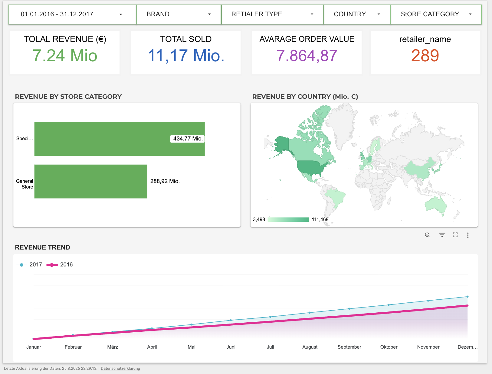
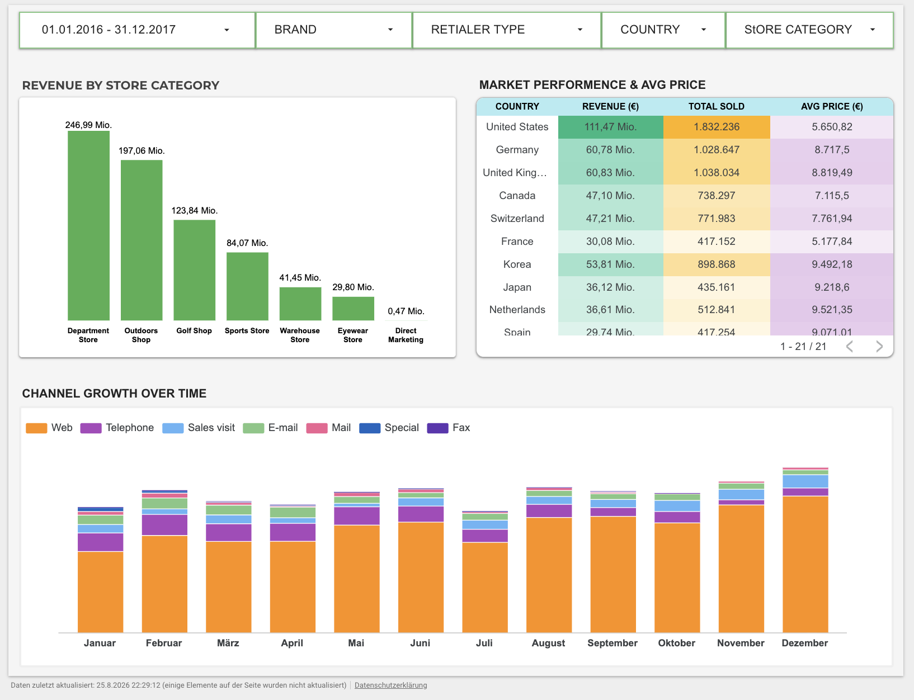
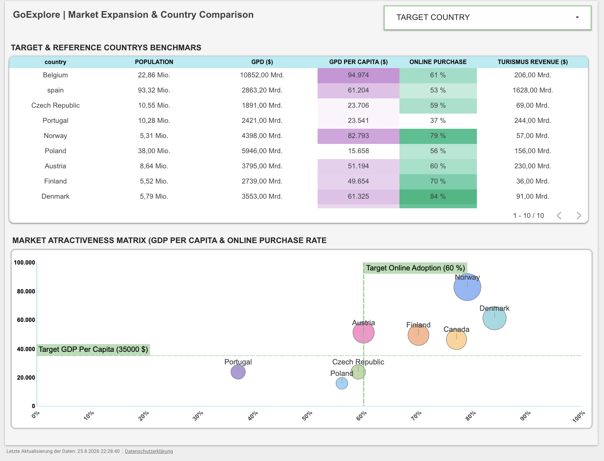

# goexplore-business-dashboard
Business analytics dashboard for GoExplore, focusing on market performance and expansion potential across selected European target markets.

# Project Overview

This project develops a business analytics dashboard for GoExplore to support data-driven decision-making.

The dashboard combines company performance data with selected external market indicators to provide insights into current business performance, shop performance, and the potential attractiveness of selected European target markets.

The project focuses on three main areas:

- Monitoring business performance through key sales and operational KPIs.
- Comparing the performance of specialized shops with general shops.
- Comparing selected target markets with reference countries to support market expansion decisions.

The dashboard is designed as an interactive decision-support tool that allows management to explore the available data, identify relevant business patterns, and support future strategic decisions.

# Project Goals and Objectives

GoExplore needs a clear and data-driven view of its business performance and potential opportunities for future market expansion.

The dashboard aims to:

- **Monitor current business and sales performance** through relevant KPIs.
- **Compare specialized shops with general shops** to identify differences in performance.
- **Evaluate selected European target markets** using relevant external market indicators.
- **Compare target markets with suitable reference countries** to support market expansion decisions.
- **Provide an interactive decision-support tool** that enables management to explore the available data and identify relevant business patterns.

The dashboard is designed as an interactive decision-support tool rather than a static analysis. It allows management to explore the available data and use the insights to support future strategic decisions.


# Key Findings

The dashboard highlights several important business insights:

- Specialized stores generated higher revenue than general stores during the analyzed period.
- Revenue performance varies significantly across countries, with the United States showing the strongest performance among the displayed markets.
- Overall revenue increased from 2016 to 2017, indicating positive business development over the analyzed period.
- Web sales represent the dominant sales channel across the displayed months.
- Among the selected target markets, Norway shows the strongest market attractiveness based on GDP per capita and online purchase rate.
- Poland and the Czech Republic show relatively strong online purchase rates but remain below the defined GDP per capita target.
- Portugal currently falls below both target thresholds, indicating lower attractiveness according to the selected market indicators.
- Reference countries are used as benchmarks to support the comparison and evaluation of potential expansion markets.

# Project Workflow

The project follows a data-driven workflow from raw CSV data to an interactive business analytics dashboard:

```text
CSV Data
    │
    ▼
BigQuery Data Warehouse
    │
    ▼
SQL Queries & KPI Calculations
    │
    ▼
BigQuery Views
    │
    ▼
Looker Studio
    │
    ▼
Interactive Business Dashboard

# Repository Structure

```text
goexplore-business-dashboard/

│
├── data/
│   ├── G-DAI_009_GoExplore - daily_sales.csv
│   ├── G-DAI_009_GoExplore - methods.csv
│   ├── G-DAI_009_GoExplore - products.csv
│   ├── G-DAI_009_GoExplore - retailers.csv
│   ├── countries.csv
│   └── external_info.csv
│
├── images/
│   ├── CEO_Executive_Summary.png
│   ├── Channel_Strategy.png
│   └── Market_Expansion.png
│
└── README.md

# Dashboard Pages

## 1. CEO Executive Summary

The CEO Executive Summary provides a high-level overview of GoExplore's current business performance.

The page allows management to monitor key business KPIs and explore overall sales performance across different countries, store categories, and time periods.

### Main Elements

- Total Revenue
- Total Sold
- Average Order Value
- Number of Retailers
- Revenue by Store Category
- Revenue by Country
- Revenue Trend over Time

<p align="center">

</p>

---

## 2. Channel & Store Performance

The Channel & Store Performance page focuses on comparing different retailer and sales channel characteristics.

It helps management understand how specialized shops perform compared with general shops and how different sales channels contribute to overall business performance.

### Main Elements

- Revenue by Store Category
- Market Performance by Country
- Revenue and Sales Volume
- Average Price
- Channel Growth over Time
- Comparison of Specialized Shops and General Shops

<p align="center">

</p>

---

## 3. Market Expansion & Country Comparison

The Market Expansion & Country Comparison page supports the evaluation of selected European target markets.

Each target country is compared with two reference countries using relevant external market indicators.

### Main Elements

- Target & Reference Country Benchmarks
- Population
- GDP
- GDP per Capita
- Online Purchase Rate
- International Tourism Revenue
- Market Attractiveness Matrix

<p align="center">

</p>

### Reference Country Selection Strategy

Each target market is compared with two reference countries.

The reference countries are selected based on two criteria:

- Similar population size to the target market.
- At least one reference country with geographic proximity to the target market.

Reference countries serve as benchmarks for evaluating the relative attractiveness of potential target markets.
